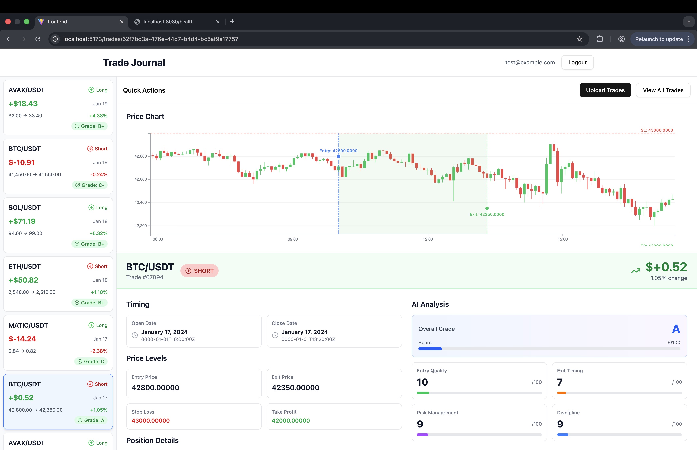

# AI Trade Journal

A cryptocurrency trading journal that uses AI to extract insights, surface behavioral patterns, and improve decision-making — not auto-trading.

## Screenshots



## MVP

A trading journal that captures crypto trades, visualizes performance with D3, and generates AI-assisted daily insights based on real metrics.

### 1. Trade Entry & Storage

User uploads CSV with the following fields:

- Ticket_ID
- Open_Date
- Open_Time
- Close_Date
- Close_Time
- Symbol (e.g., BTC/USDT, ETH/USDT)
- Direction
- Quantity (amount of crypto)
- Entry_Price
- Exit_Price
- Stop_Loss
- Take_Profit
- Price_Change_Percent
- Fee (trading fee)
- Commission
- Profit_Loss
- Balance
- Notes

### 2. For Each Trade

**Async Processing** (a simple Redis queue is enough):

1. Trade saved → event enqueued
2. Fetches candles from API (BTC API: Binance API)
   - Timeframe: 5 minutes
   - Range: 50 candles before entry + 50 candles after exit
3. Python worker generates trade summary
4. Stores candles / summaries in DB (Postgres)
5. UI refresh shows the new insight

**AI Trade Summary**:

- Overall Grade (A+ to F) and Score (1-10)
- Entry quality score (1-10)
- Exit timing score (1-10)
- Risk management score (1-10)
- Discipline score (1-10)
- Comprehensive analysis with detailed feedback
- Key observations (e.g., "Entered during consolidation", "Exited near resistance")
- Coaching summary with actionable improvements

**Views:**

- **Dashboard:**
  - View list of trades
  - Aggregate metrics: win rate, avg profit/loss, total P&L
  - Equity curve
  - Performance breakdown (by time of day / day of week)
  - Charts (D3) with overlays: entry line, exit line, SL / TP
  - AI notes / summaries per trade

## Architecture

```
Frontend (Vite + React + D3)
        ↓
API (Go + Gin)
        ↓
Postgres
        ↓
Redis Queue
        ↓
Python Worker (FastAPI)
        ↓
LLM API (OpenAI GPT-4o-mini)
```

**Framework Choices:**

- **Frontend:** Vite + React (fast dev server, modern tooling)
- **API:** Gin (most popular Go web framework, excellent performance)
- **Worker:** FastAPI (async Python, easy LLM integration)
- **LLM:** OpenAI GPT-4o-mini (best cost/performance for analysis tasks)

## Authentication

**JWT + HTTP-Only Cookies**

Stack:

- golang-jwt/jwt for token generation/validation
- bcrypt for password hashing (in Go stdlib: golang.org/x/crypto/bcrypt)
- Storage: User table in Postgres
- Session management: JWT tokens in HTTP-only cookies (more secure than localStorage)

**Mental model for authentication**

- User attents to log in
- Backend verifies credentials against DB and creates a JWT containing claimms (id, role, expires), sends it back as a HTTP-only cookie
- On every subsequent request the backend only has to do 3 cheap checks (correct signature, expiry, role allows this action)
- If user demoded, deleted, desabled, etc - most common action is to keep allowing it until expiry or use refresh cookies.

**Registration:**

```
User → Go API → Hash password → Store in Postgres → Return JWT
```

**Login:**

```
User → Go API → Verify password → Generate JWT → Set HTTP-only cookie → Return user data
```

**Protected Routes:**

```
User → Go API (with cookie) → Validate JWT → Allow/Deny request
```

## Database Schema

**users:**

- id (UUID, PK)
- email (unique, indexed)
- password_hash
- created_at
- updated_at

**trades:**

- id (UUID, PK)
- user_id (FK to users.id)
- ticket_id
- open_date
- open_time
- close_date
- close_time
- symbol (crypto trading pair, e.g., BTC/USDT)
- direction
- quantity (DECIMAL(20,8) - amount of crypto)
- entry_price
- exit_price
- stop_loss
- take_profit
- price_change_percent (percentage change)
- fee (trading fee)
- commission
- profit_loss
- balance
- notes
- created_at

**candles:**

- id (UUID, PK)
- trade_id (FK to trades.id)
- timestamp
- open
- high
- low
- close
- volume

**trade_summaries:**

- id (UUID, PK)
- trade_id (FK to trades.id, unique)
- overall_grade (VARCHAR - A+ to F)
- overall_score (INTEGER - 1-10)
- entry_score (INTEGER - 1-10)
- exit_score (INTEGER - 1-10)
- risk_score (INTEGER - 1-10)
- discipline_score (INTEGER - 1-10)
- analysis_data (JSONB - full AI analysis with feedback, observations, coaching)
- created_at
- updated_at

## Deployment

**Target:** AWS with Docker

**CI/CD:** GitHub Actions

**Infrastructure:**

- ECS or EC2 for containers
- RDS for Postgres
- ElastiCache for Redis
- S3 for static assets (React build)
- CloudFront (optional, for CDN)

## Development

### Quick Start

See [SETUP.md](SETUP.md) for detailed setup instructions.

```bash
# First time setup
make setup

# Start development
make dev
cd api && go run main.go
```

### Testing the Application

The application includes a complete authentication system with login, registration, and logout functionality.

#### Backend (Go API)

```bash
# Start the backend server
cd api
go run main.go
```

The API will be available at `http://localhost:8080`

#### Frontend (React)

```bash
# Start the frontend dev server
cd frontend
npm run dev
```

The frontend will be available at `http://localhost:5173`

#### Test Users

Use these existing test accounts to log in:

**Test User 1:**
- Email: `test@example.com`
- Password: `password123`

**Test User 2:**
- Email: `demo@example.com`
- Password: `demo1234`

**Test User 3:**
- Email: `newuser@example.com`
- Password: `test1234`

#### Creating a New Account

1. Navigate to `http://localhost:5173/register`
2. Fill in the registration form:
   - Email: `your@email.com`
   - Password: `password123` (minimum 6 characters)
   - Confirm Password: `password123`
3. Click **Create Account**
4. You'll be automatically logged in and redirected to the dashboard

#### Testing the Flow

1. **Register** → Navigate to `/register`, create a new account
2. **Login** → Navigate to `/login`, login with existing credentials
3. **Dashboard** → View your dashboard at `/` (protected route)
4. **Logout** → Click the logout button to return to the login page

### Testing

See [TESTING.md](TESTING.md) for comprehensive testing guide.

```bash
# Run all tests
make test

# Run with verbose output
make test-verbose

# Run with coverage
make test-coverage

# Generate HTML coverage report
make test-coverage-html

# Watch mode (requires watchexec)
make test-watch
```

### Common Commands

```bash
make help          # Show all available commands
make start         # Start database + API
make stop          # Stop all services
make logs          # View Docker logs
make db-shell      # Connect to Postgres
make test          # Run tests
make clean         # Remove all data
```

## Project Status

**Phase 1: Foundation** ✅ Complete

- Docker setup with Postgres and Redis
- Go API with Gin framework
- Database migrations
- Health check endpoints

**Phase 2: Authentication (Backend)** ✅ Complete

- User registration and login
- JWT token authentication
- HTTP-only cookie sessions
- Protected routes with middleware
- Comprehensive test suite

**Phase 3: Trade Upload & Storage** ✅ Complete

- CSV upload endpoint
- Trade model and storage
- Flexible CSV parser supporting multiple date formats
- All routes protected by authentication

**Phase 4: Async Processing Pipeline** ✅ Complete

- Redis queue integration
- Python worker for background processing
- Binance API integration for candle data
- Job status tracking

**Phase 5: AI Analysis** ✅ Complete

- OpenAI GPT-4 integration
- Comprehensive trade analysis
- Mock analyzer for development
- Analysis stored in database

**Phase 6: React Frontend (Authentication)** ✅ Complete

- Login page with React Hook Form + Zod validation
- Registration page with password confirmation
- Dashboard with user info and logout
- CORS configuration
- Full authentication flow working

**Phase 6: React Frontend (Next Steps)** 🚧 In Progress

- CSV upload interface
- Trade list view
- Trade detail page with AI analysis
- D3.js candlestick charts
- Dashboard metrics and visualizations

See [PLAN.md](PLAN.md) for the full roadmap.

## Notes

**Plan the Trade, Trade the Plan**

Pre-trade planner (not for the MVP)
